 AWS 클라우드 환경에 서버를 생성하고 싶을 때, 아무 설정 없이 인스턴스만 툭 하고 생성할 수도 있다. 이 경우 AWS 에서 Default로 제공하는 VPC 네트워크 환경에 인스턴스가 올라가게 된다.
 뭐 사용하는데 전혀 상관은 없지만, 원하는 대역의 사설 IP와 Subnet등을 사용하려면 VPC를 새로 생성해야 한다.
 이런 경우 기본적으로는 AWS VPC, Routing Table, Internet Gateway가 필요하다!

## AWS VPC
* VPC는 Virtual Private Cloud (가상 사설 클라우드) 의 약자이다.
* 클라우드 환경 위에 **내부망**을 생성할 수 있고 이를 사내망처럼 사용하게 된다. 이를 통해 내부 IP 사용으로 외부에서의 침입을 차단하고 (public ip를 설정하면 외부와의 연결도 가능하다.) 좀더 안전한 환경 구성에 도움이 된다.
* Private Network을 생성할 때의 IP 대역은 [rfc1918](https://tools.ietf.org/html/rfc1918){:target="_blank"}을 지키며 생성해야 한다. 간단한 설명과 CIDR은 아래와 같다.

~~~
3. Private Address Space

The Internet Assigned Numbers Authority (IANA) has reserved the
following three blocks of the IP address space for private internets:

10.0.0.0 - 10.255.255.255 (10/8 prefix)
172.16.0.0 - 172.31.255.255 (172.16/12 prefix)
192.168.0.0 - 192.168.255.255 (192.168/16 prefix)
~~~
* 참고로 AWS default VPC의 CIDR은 172.31.0.0/16 이다.
* 예전에 Terraform을 이용해서 VPC부터 시작해서 인스턴스까지 엔터한번에 주루룩 만들려고 했을 때, 위의 내용을 모르고 192.16**9**.x.x 로 설정했다가 통신이 원활하지 않고 yum update도 안되어서 하루 종일 인프라를 만들었다 지웠다 한 기억이 난다.
* 이유는 위에도 적혀있듯이 private하게 쓰라고 Reserved된 ip대역이 아니고, 따로 [whois](http://whois.kisa.or.kr/kor/main_.jsp){:target="_blank"} 에서 ip 검색 시 arin이라는 단체에서 소유한 ip대역이라는 결과가 나온다. IP 대역 설정 시 유의하도록 하자. ㅠㅠ

~~~
# ARIN WHOIS data and services are subject to the Terms of Use
# available at: https://www.arin.net/whois_tou.html
#
# If you see inaccuracies in the results, please report at
# https://www.arin.net/public/whoisinaccuracy/index.xhtml
#

#
# The following results may also be obtained via:
# https://whois.arin.net/rest/nets;q=192.169.0.1?showDetails=true&showARIN=false&showNonArinTopLevelNet=false&ex
t=netref2
#

NetRange:       192.169.0.0 - 192.169.1.255
CIDR:           192.169.0.0/23
NetName:        PSG169
NetHandle:      NET-192-169-0-0-1
Parent:         NET192 (NET-192-0-0-0-0)
NetType:        Direct Assignment
OriginAS:       
Organization:   RGnet, LLC (RGNETI-1)
RegDate:        2005-04-12
Updated:        2014-03-28
Ref:            https://whois.arin.net/rest/net/NET-192-169-0-0-1
~~~

## AWS Routing Table
* 라우팅 테이블은 VPC내의 네트워크 트래픽을 전달하는 역할을 한다.
* 라우팅 테이블은 하나의 VPC에 연결되며, 여러 서브넷들을 라우팅 테이블에 연결할 수 있다.
* 라우팅 테이블의 각각의 라우팅에는 destination CIDR과 target Gateway를 지정할 수 있다.
* AWS Default Routing Table은 Default VPC와 연결되어 있으며 destination CIDR은 VPC의 CIDR이고 target은 local gateway이다. 그렇기 때문에 외부와 통신이 되지 않고, 내부에서만 통신이 가능하다.

## AWS Internet Gateway
* VPC에 붙여 외부망과 연결해주는 역할을 하는 장치이다. 위의 Routing Table에서 말했듯이 route를 추가해줄 때 사용할 수 있다.

## 설정 방법
1. 처음 VPC Dashboard를 열면 기본(Default) VPC가 존재한다. 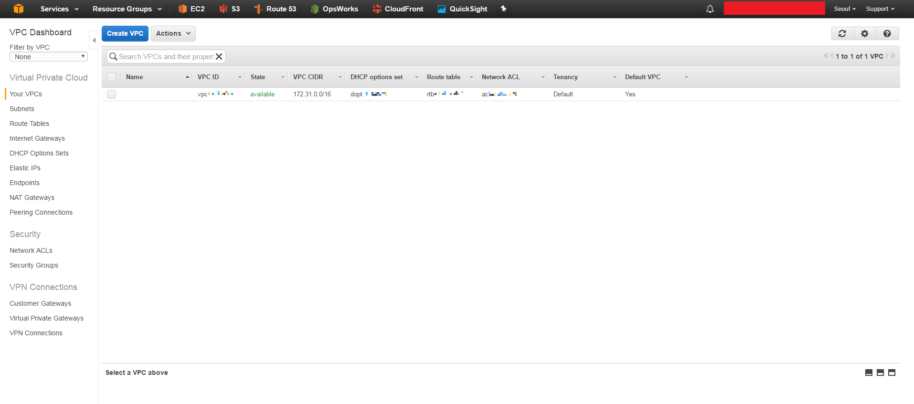
2. 새로운 VPC를 만들고 네트워크 설정을 할 수 있도록 한다. 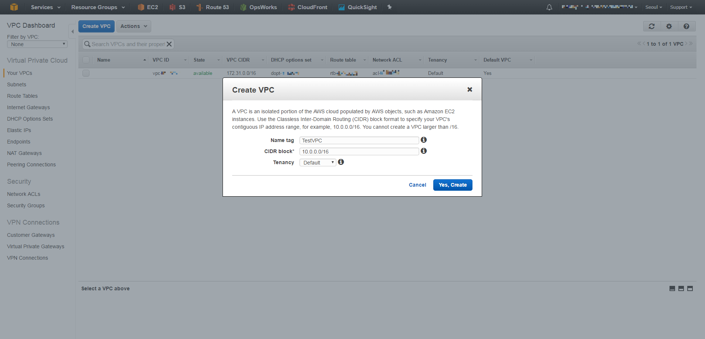
3. Route Tabler, Subnet도 기본 VPC에 관련된 것만 존재하는 것을 확인할 수 있다. 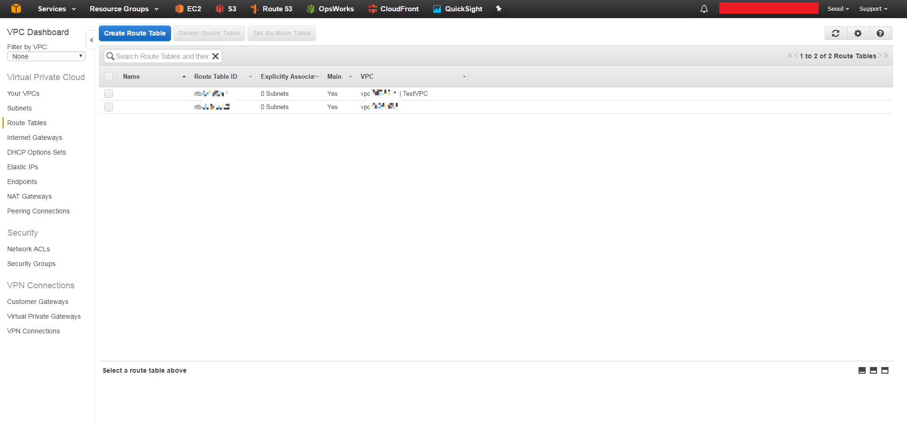 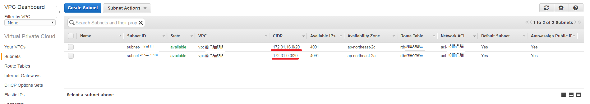
4. 새로 생성한 VPC와 연결할 수 있도록 새로운 Route Table과 Subnet을 생성한다. RouteTable은 생성할 때 어떤 VPC에 연결될지 정할 수 있다. 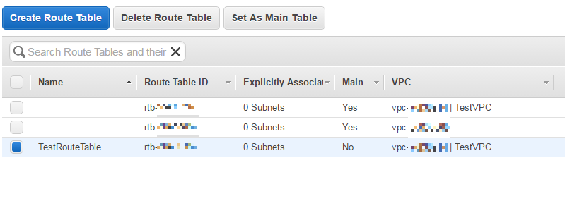 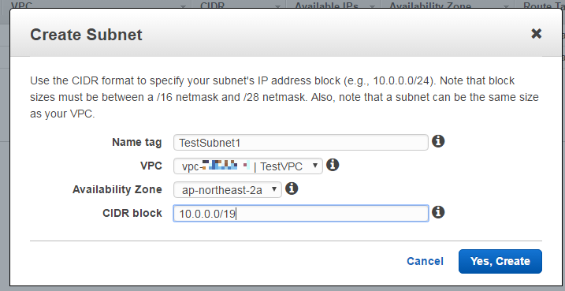
5. RouteTable에 서브넷들을 연결한다. 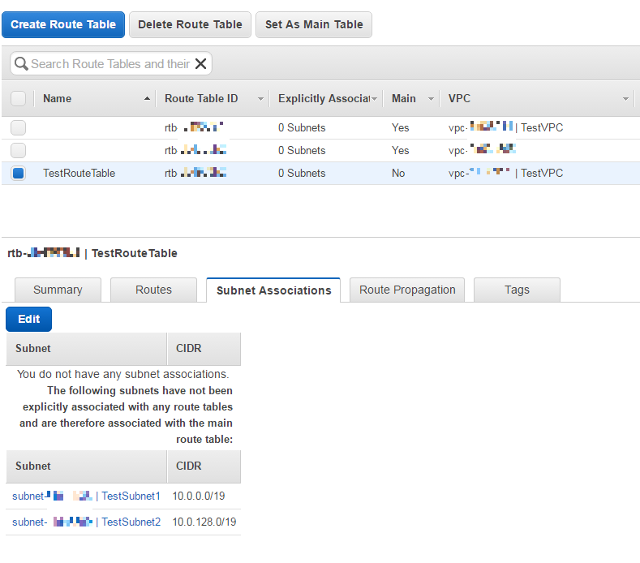 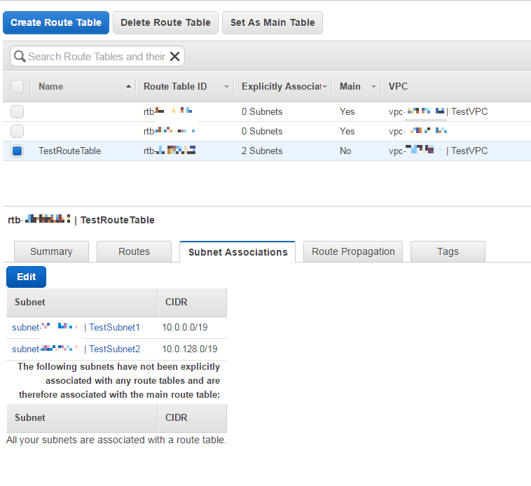
6. VPC, RouteTable, Subnet은 생성 완료되었다. 이 상태는 VPC 내부에서의 네트워크만 연결된 상태이다.
이는 RouteTable의 Route를 보면 확인할 수 있다. 아래의 상태는 로컬의 기본 게이트웨이에만 연결된 상태이다. 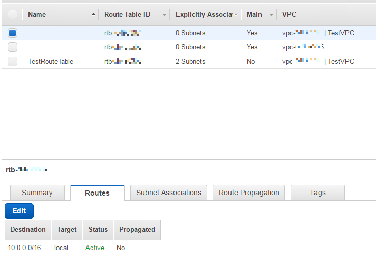
7. 외부와의 통신을 위해 Internet Gateway를 생성한다. 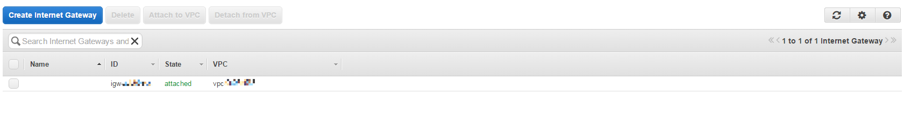 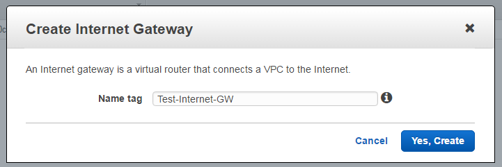
8. 생성한 Gateway를 VPC에 붙여준다. 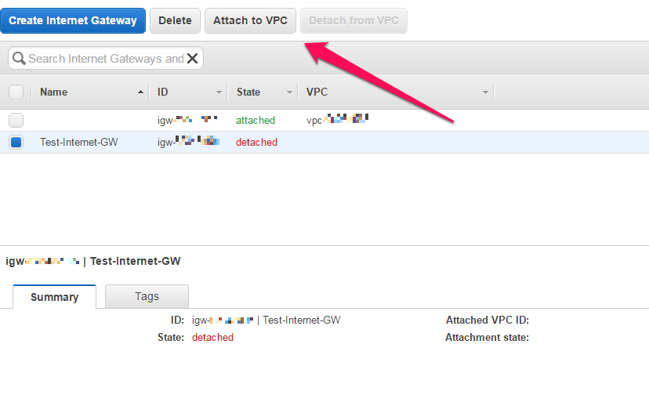 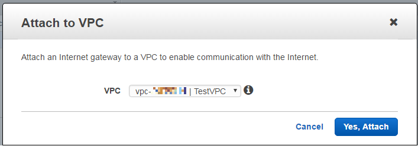
9. RouteTable의 Routing 경로를 추가한다. 새로 생성한 Internet Gateway를 이용하는 연결은 0.0.0.0/0으로 통신하도록 할 수 있다. 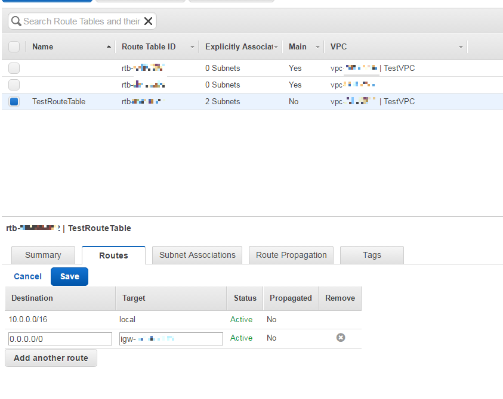
10. 이렇게 설정하면 외부와 통신 가능하다.
