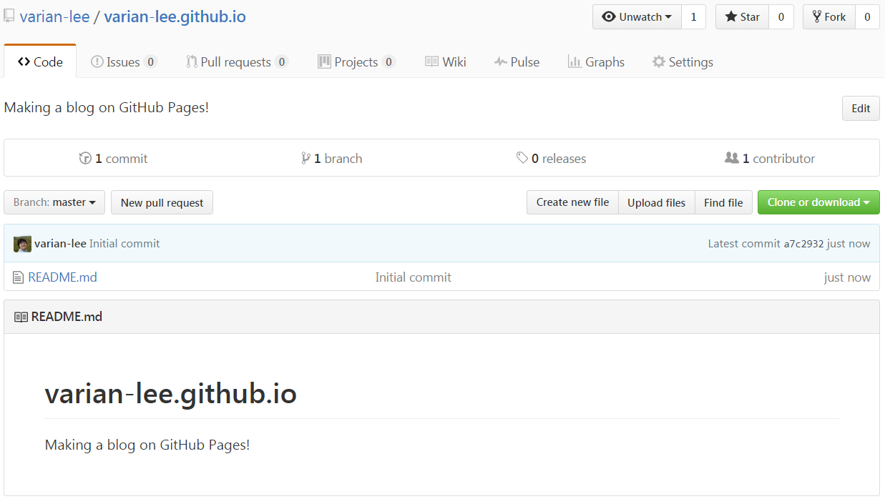

 GitHub에서는 [GitHub Pages](https://pages.github.com/){:target="\_blank"} 라는 호스팅 서비스를 제공하고 있는데, 이를 이용하면 개인 페이지(블로그)를 무료로 생성할 수 있다.

## GitHub Pages
<iframe width="560" height="315" src="https://www.youtube.com/embed/2MsN8gpT6jY" frameborder="0" allowfullscreen></iframe>

- 영상을 보니 이는 개인이 GitHub에서 하는 활동들을 정리하고 배포하라는 의미로 제공하는 서비스인 것으로 보인다.
의도가 어떻든, 이 서비스를 이용하면 GitHub 상에 소스를 올리고 개인 블로그를 작성하여 관리할 수 있다!
- 기존 블로그 구축과 다른 점은 다음과 같다.

|  | 구축형 (Wordpress) | 가입형 (Tistory) | GitHub Pages |
|:--:|:--:|:--:|:--:|
| 비용 | 유료(서버+네트웍) | 무료 | 무료 |
| 서버 구축 | 필요함 | 필요없음 | 필요없음 |
| 네트워크 설정 | 필요함 | 필요없음 | 필요없음 |
| Markdown | 가능 | 불가능(제한적) | 가능 |
| HTML 편집 | 가능 | 불가능(제한적) | 가능 |

- GitHub Pages는 **무료** 이다! 직접 서버 구축 시 돈도 들 뿐더러 관리도 해줘야 하는데 이게 여간 귀찮은 게 아니다.
- 가입형 블로그의 경우 대부분 외부 형상을 편집하기 어렵다. 제한된 프레임 안에서 내용만 작성하는 정도라 아쉬운 점이 있다.
- 마크다운 편집 같은 경우, 티스토리는 외부 에디터나, 변환기로 마크다운 문서를 변환 후 복사하여 쓸 수는 있다고 하는데 사실 이것도 귀찮은 일이다...
- GitHub Pages는 기본적으로 웹 호스팅 서비스이기 때문에 HTML로 작성한 페이지를 바로 호스팅할 수 있지만, 더 쉽고 미려한 페이지 작성을 위해 Markdown 포맷을 지원한다!

## Jekyll
- 위에서 이야기한 Markdown 포맷을 지원하기 위해, GitHub Pages에서는 [Jekyll(한국어)](https://jekyllrb-ko.github.io/){:target="\_blank"}이라는 Static Site Generator를 사용한다.
- 이게 뭔고 하니 HTML 작성에 신경쓰지 말고, 일단 텍스트 등으로 내용을 작성하면 이 **정적사이트 생성기** 가 알아서 HTML로 바꿔준다는 거다.
- 참고로 [staticsitegenerators](https://staticsitegenerators.net){:target="\_blank"} 에서 여러 Generator를 확인할 수 있는데, Jekyll은 활발히 수정되는 중인 것을 확인할 수 있다.
- GitHub Pages에서 Jekyll을 지원하는데, 빌트인 테마를 골라 간편하게 사용할 수 있고 혹은 원하는 테마를 직접 설정하고 저장소에 push하여 사용할 수 있다.

## GitHub Pages에 Jekyll 끼얹어 블로그 만들기
1. GitHub 프로젝트를 만든다.

2. **본인ID**.github.io 라는 이름으로 프로젝트를 생성하면, master 브랜치에 업로드 하는 것으로 바로 배포된다.
  (다른 방법으로 gh_pages라는 브랜치를 생성하는 방법도 있다.) 

3. 이렇게 프로젝트 생성하고, 

4. Hello World를 출력하는 HTML을 Commit, Push 한다.

5. 그러면 곧바로 본인의 url에서 확인할 수 있다. 

6. 웹 호스팅이니 당연히 HTML을 지원한다.  

7. GitHub 프로젝트 setting에서 빌트인 테마를 고를 수 있다. 고르고 나면 \_config.yml 파일에 관련 테마가 설정된 것을 확인할 수 있다. 

8. 이렇게 Jekyll 을 설정하고 나면, 마크다운파일(.md)으로 작성하고 push하면 html로 볼 수 있게 된다!

9. Markdown 문법에 맞게 잘 적으면 예쁘게 잘 보인다~

-  Built-In Jekyll Theme이 아닌 커스텀 테마를 사용하는 방법과 로컬에서 테스트하는 방법도 적어야 하는데, 이건 다음 편에....
