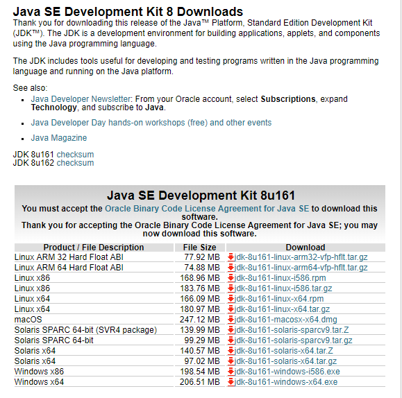

 Centos7에서 Java를 설치하는 방법을 알아보자.  
 
## wget

minimal version으로 설치했을 경우 wget이 없을 수 있다.
```shell
yum install -y wget
```

## JDK
wget 설치가 완료되면 JDK 파일을 다운로드 받는다.  

- Linux x64(32비트 운영체제라면 x86)
- rpm 파일
- 파일의 Download 링크를 우클릭 하면 링크 주소를 얻을수 있고, 복사해서 저장을 해둔다.
- 아래의 wget 명령어 중 <strong>"http:// ~~~~ "</strong> 부분에 복사한 링크로 변경한다.



```
wget --no-cookies --no-check-certificate --header "Cookie: oraclelicense=accept-securebackup-cookie" "http://download.oracle.com/otn-pub/java/jdk/7u72-b14/jdk-7u72-linux-i586.rpm"

출처: http://hellogk.tistory.com/120 [IT Code Storage]
```

rpm 파일을 다운로드 받았다면 아래명령어로 실행하여 설치한다.
```
rpm -ivh {rpm file name}
```

설치가 완료되면 java version 을 확인하여 문제없이 출력되면 잘 설치된것이다.
```
[yjkim@zoo ~]$ java -version
java version "1.8.0_161"
Java(TM) SE Runtime Environment (build 1.8.0_161-b12)
Java HotSpot(TM) 64-Bit Server VM (build 25.161-b12, mixed mode)
[yjkim@zoo ~]$
```