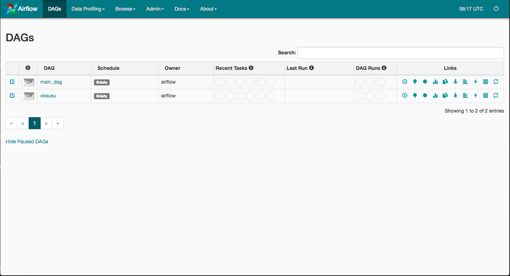

Airflow 설치 및 설정, 사용법을 잊어버리지 않기 위해 남김  
조금더 자세한 내용을 알고싶으면 진리의 [조대협님 블로그](http://bcho.tistory.com/1184)를 참고하는게 좋다

## Apache Airflow
Apache Airflow는 workflow 관리 및 모니터링을 지원하는 오픈소스 이다  
현재(2018-06-18) Apache Incubator project 이지만 여러가지 장점으로 인하여 많이 사용되고 있다

### 설치
- Airflow는 python으로 개발된 오픈 소스이므로 python이 설치되어 있어야 한다
```
[yjkim@localhost airflow]$ python --version
Python 2.7.5
[yjkim@localhost airflow]$
```

- 설치는 pip를 사용한다
```
[yjkim@localhost airflow]$ sudo pip install airflow 
```

- 기본적으로 __~/airflow__ 디렉토리가 AIRFLOW_HOME 디렉토리가 된다

- airflow의 모든 정보가 저장되는 저장소는 __sqlite__ 를 사용한다  
```
[yjkim@localhost airflow]$ airflow initdb
```

### 실행
airflow webserver를 실행하면 WebUI를 확인 할 수 있고, 스케쥴러를 실행하면 DAG에 설정된 schedule 대로 DAG를 실행하게 된다
```
[yjkim@localhost airflow]$ airflow webserver -p 8080
[yjkim@localhost airflow]$ airflow scheduler
```




