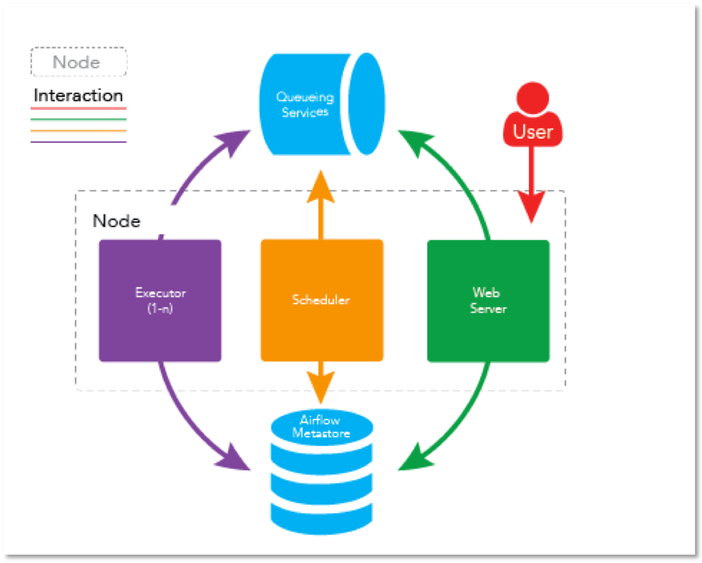
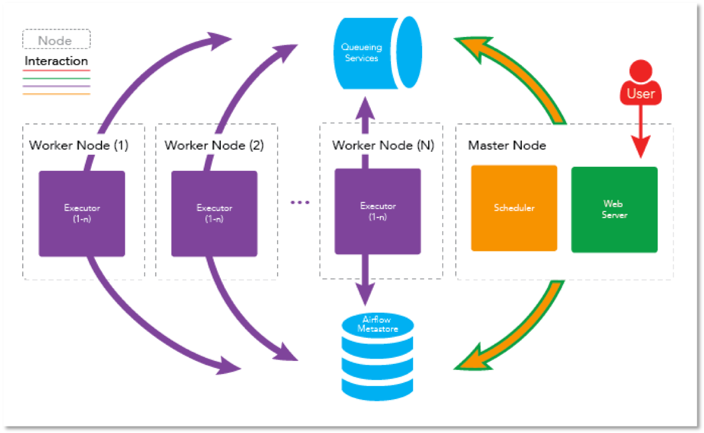

- [Apache Airflow 설치 및 사용법(1)](https://yjkim0083.github.io/airflow-1/)
- Apache Airflow 설치 및 사용법(2)

### 설정
- Airflow는 크게 3가지 설정방식이 존재한다
    - stand-alone(순차실행) : <code>SequencialExecutor</code>
    - stand-alone(병렬실행) : <code>LocalExecutor</code>
    - cluster(병렬실행) : <code>CeleryExecutor</code>

### stand-alone(순차실행)
- Airflow를 설치한뒤 설정을 변경하지 않은 상태에서 실행하게 되는 모드
- Single Node 사용
- task들의 실행이 순차적으로 실행되며, 데이터 및 상태 저장소로 <code>sqlite</code> 가 사용됨
- minimal 한 실행환경 또는 테스트 용도로 적합
- __SequencialExecutor__ 사용

### stand-alone(병렬실행)
- Single Node 사용
- task 병렬 실행이 가능하며, 데이터 및 상태 저장소로 <code>Postgresql or Mysql</code> 이 사용됨
- minimal 한 실행환경, 리소스가 많은 노드에서 실행하기 적합
- __LocalExecutor__ 사용

### cluster(병렬실행)
- Airflow를 설치한뒤 설정을 변경하지 않은 상태에서 실행하게 되는 모드
- Single Node 사용
- task들의 실행이 순차적으로 실행되며, 데이터 및 상태 저장소로 <code>Postgresql or Mysql</code> 이 사용됨
- cluster mode 이기 때문에 각 클러스터의 상태를 전송할 MQ가 필요
   - <code>RabbitMQ, Redis</code> 등을 사용
- 대규모 클러스터 모드 지원
- __CeleryExecutor__ 사용

