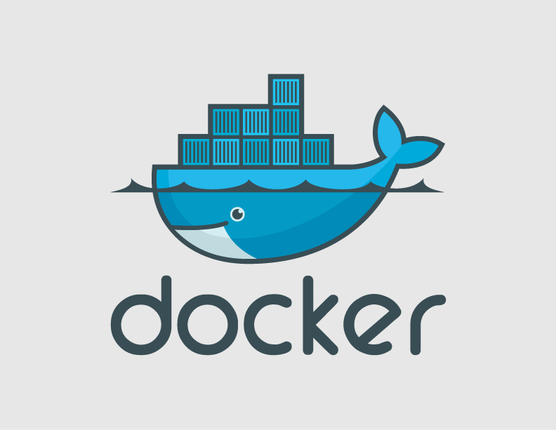

- docker 기본 명령어

### docker의 기본단위인 image 관련 명령어

- 내 PC에 있는 모든 docker image 목록 조회  
```bash
$ docker images 

REPOSITORY          TAG                 IMAGE ID            CREATED             SIZE
zanyone/ubuntu/ko   v1                  2562ffb156e0        4 days ago          454MB
<none>              <none>              7bd96dc7516c        4 days ago          448MB
zanyone/ubuntu      v3                  7907b4479ac0        4 days ago          447MB
<none>              <none>              d5a60a20bdc5        4 days ago          417MB
<none>              <none>              1a5ed1f1a3cb        5 days ago          416MB
<none>              <none>              92f3180d2f0d        5 days ago          223MB
<none>              <none>              ae1bc78c8058        9 months ago        223MB
<none>              <none>              33315a4a3bd2        9 months ago        223MB
centos              latest              980e0e4c79ec        9 months ago        197MB
ubuntu              latest              bd3d4369aebc        10 months ago       127MB
hello-world         latest              c54a2cc56cbb        12 months ago       1.85kB
```

- 'untagged/dangling' (<none>) images 조회  
```bash
$ docker images -f dangling=true

REPOSITORY          TAG                 IMAGE ID            CREATED             SIZE
<none>              <none>              7bd96dc7516c        4 days ago          448MB
<none>              <none>              d5a60a20bdc5        4 days ago          417MB
<none>              <none>              1a5ed1f1a3cb        5 days ago          416MB
<none>              <none>              92f3180d2f0d        5 days ago          223MB
<none>              <none>              ae1bc78c8058        9 months ago        223MB
<none>              <none>              33315a4a3bd2        9 months ago        223MB
```

- docker image ID만 조회 ( -q 옵션 )  
```bash
$ docker images -q -f dangling=true

7bd96dc7516c
d5a60a20bdc5
1a5ed1f1a3cb
92f3180d2f0d
ae1bc78c8058
33315a4a3bd2
```

- 모든 docker image 삭제  
```bash
$ docker rmi $(docker images -q)
```
 
- 모든 'untagged/dangling' docker image 삭제  
```bash
$ docker rmi $(docker images -q -f dangling=true)
```